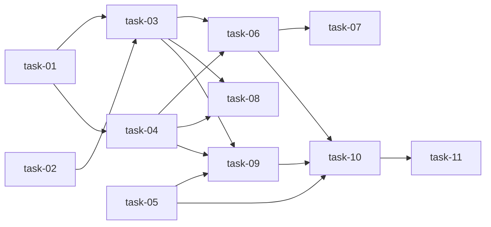

# 实现计划

## Spike 前置验证

无需 Spike。git worktree 是成熟的 Git 内置功能（git >= 2.15），设计中的 hook 拦截逻辑基于文件路径判断，无技术不确定性。

## Wave 1（基础设施，并行无依赖）

- [ ] task-01: worktree 管理核心模块
- [ ] task-02: design.md 文件变更清单解析

## Wave 2（基础设施续，依赖 Wave 1）

- [ ] task-03: apply 校验逻辑

## Wave 3（CLI + Hook，依赖 Wave 1）

- [ ] task-04: worktree 子命令注册
- [ ] task-05: Hook 拦截实现

## Wave 4（阶段集成，依赖 Wave 2 + Wave 3）

- [ ] task-06: execute 阶段前缀步骤改造
- [ ] task-07: Wave prompt 注入 worktree 路径
- [ ] task-08: execute 阶段后缀步骤改造
- [ ] task-09: quick 阶段 worktree 集成

## Wave 5（降级 + 文档，依赖 Wave 4）

- [ ] task-10: 降级与逃生逻辑
- [ ] task-11: 文档更新

## 任务总表

| 编号 | 任务 | Wave | 优先级 | 估时 | 依赖 | 说明 |
|---|---|---|---|---|---|---|
| task-01 | worktree 管理核心模块 | W1 | P0 | 4h | — | WorktreeManager 类：create/list/cleanup/getMeta |
| task-02 | design.md 文件变更清单解析 | W1 | P0 | 2h | — | parseFileChangeList，从 design.md 提取变更文件集 |
| task-03 | apply 校验逻辑 | W2 | P0 | 4h | task-01, 02 | 文件清单校验 + base hash 校验 + git apply 回写 |
| task-04 | worktree 子命令注册 | W3 | P0 | 3h | task-01 | CLI 入口注册 worktree create/apply/list/cleanup |
| task-05 | Hook 拦截实现 | W3 | P0 | 5h | — | shouldBlock 三重门禁 + Bash 白/黑名单 + 逃生开关 |
| task-06 | execute 阶段前缀步骤改造 | W4 | P0 | 2h | task-03, 04 | 固定前缀插入「创建 worktree」步骤 |
| task-07 | Wave prompt 注入 worktree 路径 | W4 | P0 | 1h | task-06 | buildWavePrompt 注入 cwd 指令 |
| task-08 | execute 阶段后缀步骤改造 | W4 | P0 | 2h | task-03, 04 | 完成确认改为 apply 流程 |
| task-09 | quick 阶段 worktree 集成 | W4 | P1 | 3h | task-03, 04, 05 | quick 走 worktree 隔离，无清单时跳过校验 |
| task-10 | 降级与逃生逻辑 | W5 | P0 | 2h | task-05, 06 | git 不支持时的降级 + --no-worktree 标志 |
| task-11 | 文档更新 | W5 | P2 | 1h | task-10 | worktree-isolation.md 使用说明 |

## 依赖关系图

## 关键路径

task-01 → task-03 → task-06 → task-10 → task-11（14h，决定最短交付周期）

## 全局验收标准

- [ ] `sillyspec worktree create/apply/list/cleanup` 四个子命令正常工作
- [ ] execute 阶段自动创建 worktree、子代理在隔离环境中写代码、完成后 apply 回主工作区
- [ ] Hook 拦截：主工作区源码写入被阻止，worktree 内写入放行，文档类文件放行
- [ ] apply 时文件清单校验生效：超出清单的文件被拦截并提示
- [ ] `SILLYSPEC_DISABLE_HOOKS=1` 环境变量可紧急禁用所有 hook
- [ ] git worktree 不可用时降级到直接模式 + 明确警告
- [ ] quick 阶段同样走 worktree 隔离流程
- [ ] 未使用 worktree 时（其他阶段、其他项目），行为完全不变
- [ ] worktree 可随时丢弃，主工作区不受影响

## 风险和注意事项

1. **Hook 误拦截**：三重门禁逻辑复杂（阶段 × 位置 × 文件），需充分测试边界情况。白名单应可配置，并提供 `SILLYSPEC_DISABLE_HOOKS=1` 紧急逃生
2. **apply 时主工作区已被修改**：base hash 校验是最后一道防线。不一致时报错而非强制 apply，用户需手动处理
3. **worktree 残留**：进程中断可能导致 worktree 未清理。`sillyspec worktree list` + `cleanup` 提供手动恢复能力
4. **quick 阶段无 design.md**：此时文件清单校验需跳过（无清单 = 允许所有变更），但仍走 apply 流程
5. **多 Agent 并行**：每个 Agent 独立 worktree + 独立分支，天然隔离。但主工作区的 apply 是串行的，需注意顺序
6. **Bash 命令拦截的边界**：不可能穷举所有危险命令，启发式判断 + 不确定时放行 + 警告，是务实的策略
