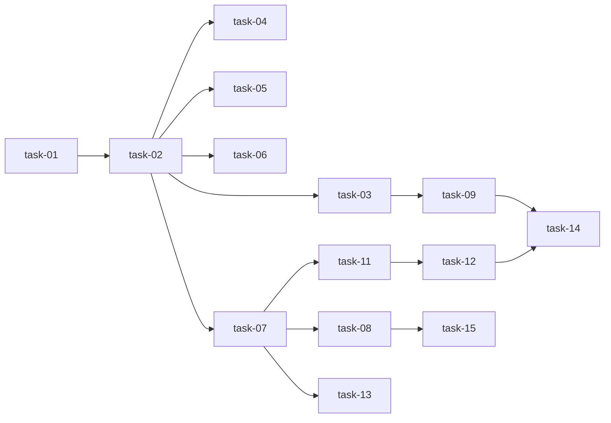

# 实现计划

author: qinyi
created_at: 2026-05-31 10:54:00

## Spike 前置验证

| Spike | 验证内容 | 不通过后果 |
|---|---|---|
| spike-01 | sql.js 在 Node.js 22 下正常加载和 CRUD | 评估 better-sqlite3 native 方案 |
| spike-02 | read() 返回 JS 对象结构与现有 progress.json 完全一致 | run.js 需要适配层 |

## Wave 1（基础设施，并行）

- [x] task-01: 安装 sql.js 依赖，验证 WASM 加载和基础 CRUD
- [x] task-02: 新增 src/db.js — SQLite 初始化、连接管理、事务包装、 schema 创建

## Wave 2（核心改造，依赖 Wave 1）

- [x] task-03: 改造 src/progress.js — readGlobal/writeGlobal 改为 SQL
- [x] task-04: 改造 src/progress.js — listChanges/registerChange/unregisterChange/initChange 改为 SQL
- [x] task-05: 改造 src/progress.js — setStage/addStep/updateStep/completeStage 改为 SQL
- [x] task-06: 改造 src/progress.js — _updateGateStatus 从 DB 查询生成 gate-status.json
- [x] task-07: 改造 src/progress.js — read/_write 改为 SQL，read() 返回值兼容性验证

## Wave 3（清理与集成，依赖 Wave 2）

- [x] task-08: 改造 src/progress.js — 删除 _parseWithRecovery/_backup/_migrateIfNeeded
- [x] task-09: 改造 src/init.js — init 时创建 SQLite 而非 global.json
- [x] task-10: 改造 src/index.js — 新增 sillyspec platform 命令组解析

## Wave 4（平台同步，依赖 Wave 2）

- [x] task-11: 新增 src/sync.js — 平台同步模块
- [x] task-12: 改造 src/run.js — _write 后触发同步、execute 前检查审批

## Wave 5（验证，依赖 Wave 3 + Wave 4）

- [x] task-13: 单元测试 — read() 返回结构与现有 JSON 一致性验证
- [x] task-14: 集成测试 — init + brainstorm → plan → execute → verify → archive 全流程
- [x] task-15: 更新 docs/sillyspec/file-lifecycle.md 文档

## 任务总表

| 编号 | 任务 | Wave | 优先级 | 估时 | 依赖 | 说明 |
|---|---|---|---|---|---|---|
| task-01 | 安装 sql.js 依赖，验证 WASM 加载 | W1 | P0 | 0.5h | — | spike-01 同步执行 |
| task-02 | 新增 src/db.js | W1 | P0 | 2h | — | DB 封装层 |
| task-03 | readGlobal/writeGlobal 改 SQL | W2 | P0 | 1h | task-02 | 最简单的读写替换 |
| task-04 | listChanges/register/unregister/initChange | W2 | P0 | 2h | task-02 | 变更管理 |
| task-05 | setStage/addStep/updateStep/completeStage | W2 | P0 | 3h | task-02 | 阶段步骤 CRUD |
| task-06 | _updateGateStatus 改 SQL | W2 | P0 | 1h | task-02 | 物化视图 |
| task-07 | read/_write 改 SQL | W2 | P0 | 4h | task-02 | spike-02 验证兼容性 |
| task-08 | 删除废弃方法 | W3 | P0 | 0.5h | task-07 | 清理 |
| task-09 | src/init.js 改造 | W3 | P0 | 1h | task-03 | init 流程 |
| task-10 | sillyspec platform 命令 | W3 | P1 | 1h | — | CLI 入口扩展 |
| task-11 | src/sync.js | W4 | P1 | 3h | task-07 | 平台同步模块 |
| task-12 | src/run.js 同步集成 | W4 | P1 | 2h | task-11, task-07 | 触发同步+审批 |
| task-13 | 单元测试 | W5 | P0 | 2h | task-07 | 兼容性验证 |
| task-14 | 集成测试 | W5 | P0 | 3h | task-09, task-12 | 全流程回归 |
| task-15 | 更新文档 | W5 | P2 | 1h | task-08 | file-lifecycle.md |

## 依赖关系图

## 关键路径

task-01 → task-02 → task-07 → task-13 → task-14（read/_write 是核心依赖链）

## 全局验收标准

- [x] `npm install` 无编译环境依赖
- [x] `sillyspec init` 创建 .sillyspec/.runtime/sillyspec.db
- [x] `sillyspec progress show` 从 SQLite 读取，输出格式与改造前一致
- [x] `sillyspec run brainstorm --change test-change` 全流程正常
- [x] `sillyspec run plan --change test-change` 正常
- [x] `sillyspec run execute --change test-change` 正常（含 gate-status 生成）
- [ ] `sillyspec run verify --change test-change` 正常
- [ ] `sillyspec run archive --change test-change` 正常
- [x] gate-status.json 在 execute 阶段自动生成、退出后删除
- [x] 无 global.json / progress.json 文件残留（新项目）
- [x] `sillyspec platform status` 命令可用
- [x] read() 返回对象结构与现有 JSON 完全一致
