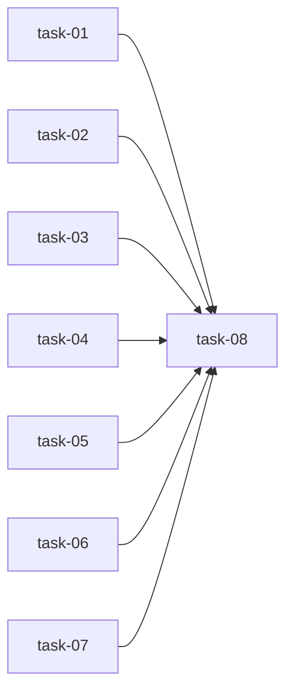

# 实现计划

## Spike 前置验证

无需 Spike，技术方案明确。

## Wave 1（并行，无依赖）

- [ ] task-01: 更新 Scan 阶段 Step 7/10 prompt（生成 _module-map.yaml）
- [ ] task-02: 更新 Scan 阶段 Step 8/10 prompt（生成精简模块卡片）
- [ ] task-03: 更新 Scan 阶段 Step 9/10 prompt（生成 flows/glossary，可选）
- [ ] task-04: 更新 Brainstorm 阶段 Step 2/10 prompt（加载 _module-map.yaml 并匹配模块）
- [ ] task-05: 更新 Plan/Execute 阶段 prompt（从 _module-map.yaml 读取索引）
- [ ] task-06: 生成示例 _module-map.yaml
- [ ] task-07: 生成示例模块卡片

## Wave 2（依赖 Wave 1）

- [ ] task-08: 验证所有 prompt 更新完成

## 任务总表

| 编号 | 任务 | Wave | 优先级 | 估时 | 依赖 | 说明 |
|---|---|---|---|---|---|---|
| task-01 | 更新 Scan Step 7/10 prompt | W1 | P0 | 2h | — | 生成 _module-map.yaml 的 prompt |
| task-02 | 更新 Scan Step 8/10 prompt | W1 | P0 | 2h | — | 生成精简模块卡片的 prompt |
| task-03 | 更新 Scan Step 9/10 prompt | W1 | P1 | 1h | — | 生成 flows/glossary 的 prompt（可选） |
| task-04 | 更新 Brainstorm Step 2/10 prompt | W1 | P0 | 1h | — | 加载 _module-map.yaml 并匹配模块 |
| task-05 | 更新 Plan/Execute prompt | W1 | P0 | 1h | — | 从 _module-map.yaml 读取索引 |
| task-06 | 生成示例 _module-map.yaml | W1 | P1 | 0.5h | — | 示例文件 |
| task-07 | 生成示例模块卡片 | W1 | P1 | 0.5h | — | 示例文件 |
| task-08 | 验证所有 prompt 更新完成 | W2 | P0 | 1h | task-01,02,03,04,05 | 确认所有修改完成 |

## 依赖关系图

## 关键路径

task-01 → task-08（最长路径，决定最短交付周期，估时 3h）

## 全局验收标准

- [ ] Scan 阶段 Step 7/10 prompt 已更新，包含 _module-map.yaml 格式说明
- [ ] Scan 阶段 Step 8/10 prompt 已更新，包含精简模块卡片格式说明
- [ ] Scan 阶段 Step 9/10 prompt 已更新，包含 flows/glossary 生成说明
- [ ] Brainstorm 阶段 Step 2/10 prompt 已更新，包含 _module-map.yaml 加载和模块匹配说明
- [ ] Plan/Execute 阶段 prompt 已更新，包含从 _module-map.yaml 读取索引的说明
- [ ] 示例 _module-map.yaml 已生成
- [ ] 示例模块卡片已生成
- [ ] 所有文档头部包含 author 和 created_at